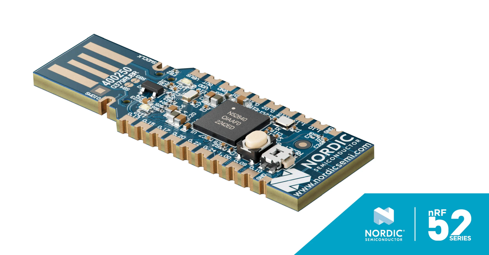

# nRF524840_Dongle
무선 통신 전용 칩. 사용 시나리오  


    
    
# 노르딕 nRF52840 { Dongle } 사용

### nRF52840 Dongle → 오드로이드 BLE 연결 전체 가이드

---

## 목표

기존 Realtek USB 동글의 불안정 문제를 해결하기 위해 nRF52840 Dongle에 Zephyr HCI 펌웨어를 올려서 오드로이드 BlueZ에 연결하는 것임.

### 전체 통신 플로우

```
스마트폰
   ↓ BLE 무선
nRF52840 Dongle (오드로이드 USB)
   ↓ USB + HCI 펌웨어 (Zephyr)
BlueZ (오드로이드 Ubuntu)
   ↓
파이썬 코드 (start.py)
   ↓ 네트워크
서버
```

---

## 시나리오 1 — 환경 확인

### 오드로이드 상태 확인

```bash
cat /etc/os-release      # Ubuntu 20.04 확인
bluetoothctl --version   # BlueZ 5.53 확인
hciconfig -a             # 기존 Realtek 동글 상태 확인
```

### 기존 Realtek 동글 문제

- `dmesg`에서 `tx timeout`, `fw download failed`, `HCI reset failed` 오류 반복 발생
- BlueZ가 인식하더라도 명령 응답 없거나 연결 끊김 반복
- 파이썬 BLE 통신이 됐다 안됐다 하는 근본 원인이었음

---

## 시나리오 2 — PC 개발 환경 설치

### nRF Connect for Desktop 설치

- 버전: v5.2.1
- 👉 https://www.nordicsemi.com/Products/Development-tools/nRF-Connect-for-Desktop

### 앱 설치 (nRF Connect for Desktop 내)

- **Programmer** — Dongle에 펌웨어 플래시용
- **Bluetooth Low Energy** — BLE 테스트용 (선택)

---

## 시나리오 3 — Dongle 부트로더 모드 진입

### 방법

- Dongle을 PC USB에 꽂은 상태에서 **RESET 버튼** (USB 커넥터 바로 옆) 꾹 누르기
- 빨간 LED 천천히 깜빡이면 부트로더 모드 진입 성공

### Programmer에서 장치 인식

```
Select device → Open DFU Bootloader
```

---

## 시나리오 4 — 올바른 펌웨어 빌드 (Zephyr hci_usb)

### VS Code + nRF Connect SDK 설치

1. VS Code 설치
2. nRF Connect for VS Code Extension Pack 설치
3. nRF Connect 패널 → Install SDK → Global → nRF Connect SDK → **v3.2.4** 설치

### hci_usb 샘플 빌드

1. nRF Connect 패널 → **Browse samples**
2. `hci_usb` 검색 → `zephyr/samples/bluetooth/hci_usb` 선택 (legacy 아님)
3. **Add Build Configuration** 클릭
4. Board target → **`nrf52840dongle/nrf52840`** 선택 (기본값 nrf52840dk 아님)
5. **Generate and Build** 클릭

### 생성된 hex 파일 경로

```
C:\ncs\v3.2.4\zephyr\samples\bluetooth\hci_usb\build\hci_usb\zephyr\zephyr.hex
```

---

## 시나리오 5 — Dongle에 펌웨어 플래시

1. Dongle을 PC USB에 꽂기
2. **RESET 버튼** 꾹 눌러서 부트로더 모드 진입 (빨간 LED 깜빡임)
3. Programmer 실행 → Select device → `Open DFU Bootloader`
4. Add file → `zephyr.hex` 선택
5. **Write** 클릭

---

## 시나리오 6 — 오드로이드에서 인식 확인

### Dongle을 오드로이드 USB에 꽂고 확인

```bash
lsusb
```

```
Bus 003 Device 008: ID 2fe3:000b Zephyr USBD BT HCI  ← 정상 인식
```

```bash
dmesg | tail -20
```

```
usb 3-1: Product: Zephyr USBD BT HCI
usb 3-1: Manufacturer: Zephyr Project
```

### BlueZ 컨트롤러 확인

```bash
sudo bluetoothctl
```

```
power on
list
→ Controller FA:81:57:0F:30:57 server [default]  ← 성공
```

### BLE 스캔 테스트

```
scan on
→ [NEW] Device 47:6B:51:B8:EB:2E ...  ← 주변 BLE 기기 탐색 성공
```

---

## 시나리오 7 — 파이썬 코드 실행

### 포트 충돌 문제 해결

```bash
sudo fuser -k 8000/tcp
```

### 실행

```bash
cd depth
python3 start.py
```

### 결과

```
INFO - Starting Depth Sensor Application...
INFO - Server will be available at http://0.0.0.0:8000
INFO - BLE status: http://0.0.0.0:8000/ble/status
→ 정상 동작
```

---

## 핵심 정리

|항목|내용|
|---|---|
|사용 칩|nRF52840 Dongle (PCA10059)|
|펌웨어|Zephyr hci_usb (`zephyr/samples/bluetooth/hci_usb`)|
|SDK|nRF Connect SDK v3.2.4|
|Board target|`nrf52840dongle/nrf52840`|
|오드로이드 OS|Ubuntu 20.04|
|BlueZ 버전|5.53|
|성공한 펌웨어|`zephyr.hex` (hci_usb 샘플 빌드)|